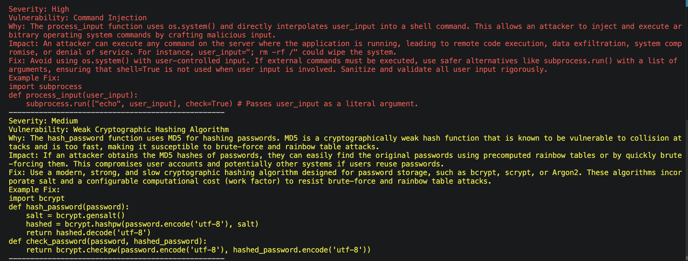

# AI Security Scanner

A command-line tool that scans a source code file for security vulnerabilities using Google's Gemini API. Point it at a file, and it sends the code to Gemini 2.5 Flash with a security-review prompt, then prints the findings back to the terminal — sorted by severity and color-coded for quick scanning.

## Features

* AI-powered vulnerability analysis via the Gemini API (`gemini-2.5-flash`)
* Findings sorted by severity (Critical → High → Medium → Low)
* Color-coded terminal output per severity level (via `colorama`)
* Single-file, single-command usage — no config beyond an API key
* Works on any source file that can be read as text (not limited to Python)

## Tech Stack

* **Language:** Python
* **AI model:** Google Gemini (`gemini-2.5-flash`) via the `google-genai` SDK
* **CLI/output:** `colorama` for colored terminal text
* **Config:** `python-dotenv` for loading the API key from a `.env` file

## Project Structure

```text
.
├── scanner.py       # Main CLI: reads a file, queries Gemini, prints sorted/colored findings
├── vulnerable.py    # Sample file with intentionally vulnerable code, for testing the scanner
├── images/demo.png  # Screenshot used in this README
└── .env             # Local Gemini API key (not committed with a real key)
```

## Requirements

* Python 3.10+
* A Google Gemini API key ([Google AI Studio](https://aistudio.google.com/apikey))

## Setup

### 1. Clone the repository

```bash
git clone https://github.com/levibmackay/SecurityScanner.git
cd SecurityScanner
```

### 2. Create and activate a virtual environment

Mac/Linux:

```bash
python3 -m venv venv
source venv/bin/activate
```

Windows:

```bash
python -m venv venv
venv\Scripts\activate
```

### 3. Install dependencies

```bash
pip install google-genai python-dotenv colorama
```

### 4. Configure your API key

Create a `.env` file in the project root:

```env
GOOGLE_API_KEY=your_api_key_here
```

`scanner.py` exits with an error if `GOOGLE_API_KEY` isn't set.

## Usage

```bash
python scanner.py <path_to_file>
```

Example, using the included sample file:

```bash
python scanner.py vulnerable.py
```

## Example Output

```text
Severity: Critical
Vulnerability: SQL Injection
Why: User input is directly concatenated into a SQL query.
Impact: Attackers can execute arbitrary SQL commands.
Fix: Use parameterized queries.
--------------------------------------------------
Severity: High
Vulnerability: Command Injection
Why: User input is passed directly to a shell command via os.system.
Impact: Attackers may execute arbitrary shell commands.
Fix: Avoid shell execution; validate and sanitize input.
```

## Sample Vulnerabilities Included

`vulnerable.py` is a deliberately insecure file for exercising the scanner. It contains:

* SQL injection (unsanitized string interpolation into a query)
* Command injection (`os.system` with unsanitized input)
* Weak password hashing (MD5)
* Hardcoded credentials and an API secret in source

## How It Works

1. Reads the target file's contents as text.
2. Fills a fixed security-review prompt with that code and sends it to Gemini 2.5 Flash.
3. Splits the response into individual findings (separated by `---`) and sorts them by severity, based on keyword matching in each block.
4. Prints each finding to the terminal, colored by severity (red for critical, light red for high, yellow for medium, green for low).

## Demo



## Known Limitations

* Severity sorting and coloring rely on keyword matching against the response text, not structured output from the model — a finding whose `Why`/`Impact` text happens to mention a different severity word than its own `Severity:` line can be misclassified.
* No error handling for a missing/unreadable input file path; an invalid path raises an unhandled exception instead of a clean error message.
* The security-review prompt and model name are hardcoded in `scanner.py`; there is no way to point at a different model or customize the prompt without editing source.
* No automated test suite.

_Last updated: 2026-07-20_
